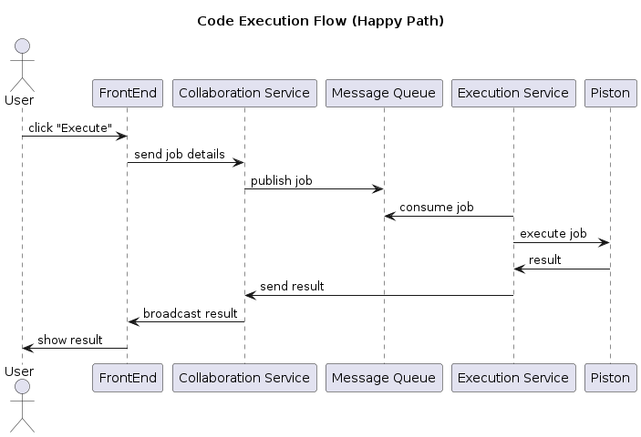
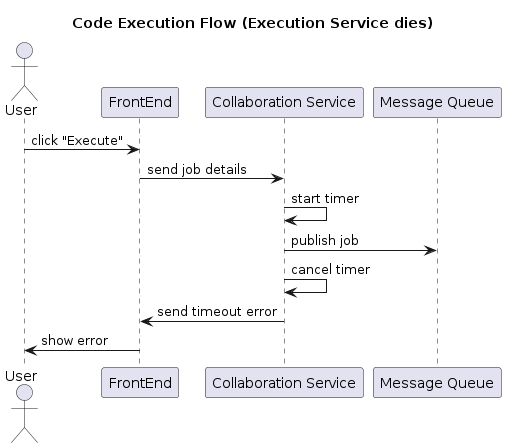

# Execution service implementation
## Design
To execute user-submitted code, we utilized `Piston`, an open-source code execution API. Our decision was based on the following key assurances it provides:
- Sandbox environment for code execution
- Ensure safe execution with resource limits and security isolation
- Comprehensive language support (for required languages)
- Self-deployment via Docker eliminates execution limits, satisfying NFR 1.2 (The system should be able to handle at least 100 concurrent collaborative sessions) more effectively than other current external options.

A Message Queue (MQ) is implemented to manage job submission from the `Collaboration Service`, ensuring stability under heavy load.

The `Execution Service` (worker) fetches the job from the MQ, utilizes Piston for processing, and sends the final result back to the `Collaboration Service` via a callback function.

Basic workflow for code execution is as follows:
1.  Frontend submits job details (`room_id`, `source_code`, `language`) to the Collaboration Service.
1. The Collaboration Service creates the job and publishes it to the MQ.
1. The Execution Service fetches the job from the MQ.
1. The Execution Service executes the job using Piston.
1. Upon completion, the Execution Service acknowledges the job in the MQ and uses a callback function to send the result to the Collaboration Service.
1. The Collaboration Service then broadcasts this result to the Frontend for all users in the room.



To ensure stability and a reliable user experience, we implement error handling by timeout strategy:

- Collaboration Service initiates an asynchronous 60-second timeout after publishing a job to the MQ. If the Execution Service fails to callback, the Collaboration Service broadcasts a timeout error to all users.
- Execution Service is designed to automatically retrying job processing (Piston API calls) up to 3 times with incremental delays against transient failures.
- To protect against malicious code or infinite loops, the Execution Service enforces a strict 40-second execution limit within the Piston API itself, returning a "Time limit exceeded" error if surpassed.

For example, below is the sequence diagram for the case when Execution Service is unavailable:



## API
### Collaboration Service

#### POST `/api/v1/code/submit-code`

API for Frontend to submit code 

Request: a JSON for code submission
```bash
{
    room_id,
    language,
    source_code,
}
```
Response:
- Status 202 if successfully sent job to MQ
- Status 500 if occurred error

#### POST `/api/v1/code/execute-callback`
API for Execution Service send the result after finish execution

Request: a JSON for code execution result
```bash
{
    room_id,
    isError,
    output,
}
```
After that Collaboration service will broadcast the result to the Frontend

Response:
- Status 200 if successfully broadcast result to Frontend
- Status 500 if occurred error

## Note