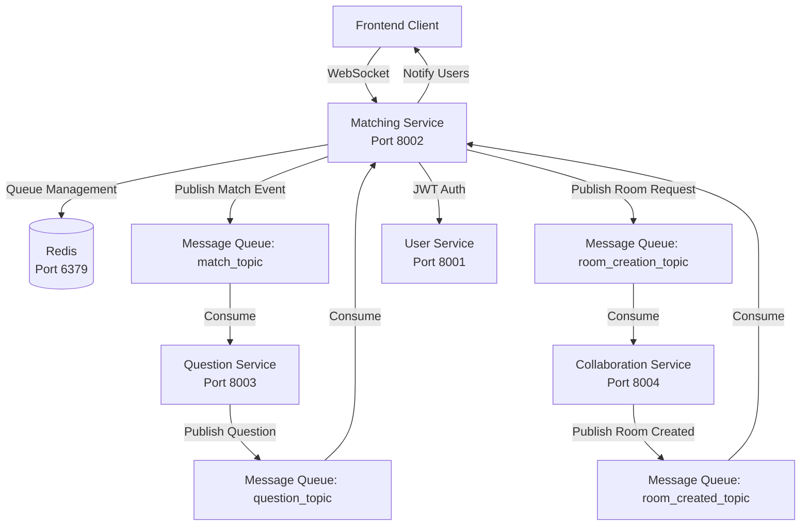

# Matching Service

## Overview

The Matching Service is responsible for pairing users for collaborative coVding practice sessions based on their topic and difficulty preferences. It uses real-time WebSocket communication, Redis for queue management, and a message queue for asynchronous inter-service communication.

## Architecture & Deployment

### Microservices Layout

The matching service is part of a microservices architecture that includes:

- **Matching Service** (this service) - Port 8002
- **User Service** - Port 8001 (authentication)
- **Question Service** - Port 8003 (question selection)
- **Collaboration Service** - Port 8004/8005 (room management)
- **Execution Service** - Code execution
- **Video Call Service** - Port 8011

### Data Flow

The matching process follows this flow:

1. User connects via Socket.IO and requests a match
2. User is added to Redis sorted set (matching_queue)
3. Background worker periodically checks queue and matches compatible users
4. On match, event is published to message queue (match_topic)
5. Question service consumes match event and selects a question
6. Question service publishes question to message queue (question_topic)
7. Matching service receives question and requests room creation via message queue (room_creation_topic)
8. Collaboration service creates room and publishes room_created event
9. Matching service notifies both users via Socket.IO with match details

### Key Integrations

- **Redis**: Queue management, match data storage, distributed locking
- **Message Queue**: Async messaging with question-service and collaboration-service
- **Socket.IO**: Real-time bidirectional communication with frontend
- **JWT**: Authentication via user-service

### Architecture Diagram



## API Documentation

### WebSocket Events

#### Client → Server Events

**matchStart**

- **Description**: Request to start matching with specified criteria
- **Payload**:
  ```typescript
  {
    topic: string;      // e.g., "Arrays", "all"
    difficulty: string; // e.g., "Easy", "Medium", "Hard", "all"
  }
  ```
- **Response**: None (countdown starts automatically)

**stopQueuing**

- **Description**: Cancel current matching request
- **Payload**: None
- **Response**: User removed from queue

**disconnect**

- **Description**: Automatically handled on socket disconnect
- **Effect**: User removed from queue

#### Server → Client Events

**matchCountdown**

- **Description**: Periodic countdown updates while waiting for match
- **Payload**: `number` (seconds remaining, default 60s)

**roomPreparing**

- **Description**: Match found, room is being prepared
- **Payload**:
  ```typescript
  {
    message: string;
  }
  ```

**matchSuccess**

- **Description**: Match completed successfully, room ready
- **Payload**:
  ```typescript
  {
    message: string;
    topic: string;
    difficulty: string;
    attemptStartedAt: number;
    matchId: string;
    roomId: string;
    matchUserId: string;
    questionId: string;
  }
  ```

**matchTimeout**

- **Description**: No match found within timeout period
- **Payload**:
  ```typescript
  {
    message: string;
  }
  ```

**matchCancelled**

- **Description**: Match was cancelled due to error
- **Payload**:
  ```typescript
  {
    message: string;
  }
  ```

**matchError**

- **Description**: Error occurred during matching process
- **Payload**: Error details

### HTTP Endpoints

**GET /health**

- **Description**: Health check endpoint
- **Response**:
  ```json
  {
    "status": "OK",
    "service": "matching-service"
  }
  ```

### Message Queue Topics

**Produced Topics:**

- `match_topic`: Match events sent to question service
- `room_creation_topic`: Room creation requests sent to collaboration service

**Consumed Topics:**

- `question_topic`: Question responses from question service
- `room_created_topic`: Room creation confirmations from collaboration service

## Runbooks

### Starting the Service

**Development:**

```bash
cd backend/matching-service
pnpm install
pnpm run dev
```

**Production (Docker):**

```bash
docker-compose up matching-service
```

### Environment Variables

Required environment variables:

- `PORT`: Service port (default: 8002)
- `REDIS_URL`: Redis connection URL (default: redis://localhost:6379)
- `MESSAGE_QUEUE_HOST`: Message queue broker host (default: localhost)
- `MESSAGE_QUEUE_PORT`: Message queue broker port (default: 9092)
- `MESSAGE_QUEUE_BROKERS`: Comma-separated message queue broker list
- `JWT_SECRET`: Secret for JWT token verification
- `MATCH_COUNTDOWN_SECONDS`: Countdown duration in seconds (default: 60)
- `MATCHING_INTERVAL_MS`: Matching worker interval in milliseconds (default: 1000)
- `DEBUG_MODE`: Enable debug mode (default: false)
- `DEBUG_MATCHING`: Enable detailed matching logs (default: false)

### Monitoring & Debugging

**Check Redis Queue Status:**

```bash
redis-cli
> ZRANGE matching_queue 0 -1 WITHSCORES
> HGETALL user:<socketId>
```

**View Message Queue Messages:**

```bash
# View messages in message queue (implementation depends on message queue provider)
# For Google Pub/Sub, use gcloud CLI or Pub/Sub console
# For Kafka, use kafka-console-consumer
```

**Check Service Health:**

```bash
curl http://localhost:8002/health
```

**View Logs:**

```bash
# Docker
docker logs matching-service -f

# Local
# Logs are output to stdout/stderr
```

### Common Issues

**Issue: Users not matching**

- Check Redis connection: `redis-cli ping`
- Verify users are in queue: `ZRANGE matching_queue 0 -1`
- Check matching worker logs for errors
- Verify topic/difficulty compatibility

**Issue: Message queue connection failures**

- Verify message queue service is running
- Check MESSAGE_QUEUE_BROKERS environment variable
- Review message queue connection logs

**Issue: Socket authentication failures**

- Verify JWT_SECRET is set correctly
- Check token format in client requests
- Enable DEBUG_MODE for testing

### Graceful Shutdown

The service handles SIGINT/SIGTERM signals to:

1. Clear all matching data from Redis
2. Clean up message queue consumer groups
3. Disconnect from Redis and message queue
4. Exit gracefully

## Design Documentation

### Matching Algorithm

The matching service uses a greedy matching algorithm:

1. **Queue Management**: Users are stored in a Redis sorted set (`matching_queue`) with score = timestamp
2. **Compatibility Check**: Two users can match if:

   - Topics are compatible: either both have same topic, or one/both have "all"
   - Difficulties are compatible: either both have same difficulty, or one/both have "all"

3. **Match Selection**: First-come-first-served (FIFO) based on queue order
4. **Lock Mechanism**: Distributed Redis lock prevents concurrent matching attempts

**Topic Compatibility:**

- `topicA === topicB` → Match
- `topicA === "all"` OR `topicB === "all"` → Match
- Otherwise → No match

**Difficulty Compatibility:**

- `difficultyA === difficultyB` → Match
- `difficultyA === "all"` OR `difficultyB === "all"` → Match
- Otherwise → No match

### Data Structures

**Redis Keys:**

- `matching_queue`: Sorted set of user keys (score = timestamp)
- `user:<socketId>`: Hash containing user data (socketId, userId, topic, difficulty, requestedAt)
- `<matchId>`: Hash containing match data (user1, user2, topic, difficulty, questionId, roomId)
- `lock:matching_worker`: Distributed lock for matching worker
- `match_processed:<matchId>`: Flag to prevent duplicate processing (TTL: 1 hour)

### Concurrency & Scalability

- **Distributed Locking**: Redis-based locks prevent race conditions in multi-instance deployments
- **Worker Interval**: Configurable matching interval (default: 1 second)
- **Lock TTL**: 2 seconds to prevent deadlocks
- **Cleanup**: Automatic cleanup of disconnected users during matching cycle

### Error Handling

- **Socket Disconnection**: Automatic queue removal on disconnect
- **Message Queue Failures**: Error logging and user notification via Socket.IO
- **Redis Failures**: Connection retry with exponential backoff
- **Duplicate Prevention**: Idempotency checks using Redis flags

### Security

- **Authentication**: JWT token verification via Socket.IO middleware
- **Authorization**: User ID extracted from JWT token
- **Debug Mode**: Optional debug mode for development (bypasses auth)

## Dependencies

- **express**: HTTP server framework
- **socket.io**: WebSocket server
- **redis**: Redis client
- **kafkajs**: Message queue client (can be replaced with Google Pub/Sub client in production)
- **jsonwebtoken**: JWT verification
- **uuid**: Match ID generation
- **cors**: CORS middleware

## Development

### Project Structure

```
backend/matching-service/
├── src/
│   ├── config/          # Configuration (Redis, Message Queue, Socket)
│   ├── constants/       # Constants (events, status)
│   ├── controllers/     # Matching controller
│   ├── middleware/      # Authentication middleware
│   ├── models/          # Type definitions
│   ├── workers/         # Background workers
│   └── index.ts         # Entry point
├── Dockerfile.matching  # Docker configuration
└── package.json         # Dependencies
```

### Building

```bash
pnpm run build
```

### Testing

Currently no automated tests. Manual testing via:

1. Connect multiple clients via Socket.IO
2. Send matchStart events with different criteria
3. Verify matching behavior and message queue flow

