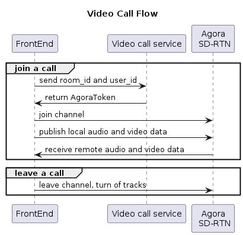
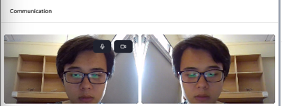
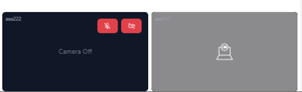
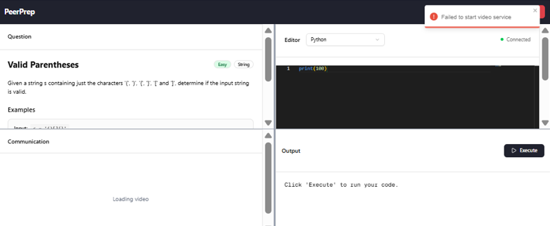

# Video call service implementation
## Design
To execute user-submitted code, we utilized `Agora`, a third-party code execution API. Our decision was based on the following key assurances it provides:
- Quick implementation
- Free package provides 10000 minutes per month

Basic workflow for code execution is as follows:
1. Frontend sends room_id and user_id to Video-call-service to create Agora Token
1. Frontend joins Agora channel
1. Frontend creates local video track and local audio track
1. Frontend sends video and audio data to channel
1. Frontend subscribes to remote users
1. Frontend gets remote audio and video
1. When user leaves, closes tab, or refreshes tab, the `useJoin` hook automatically leaves Agora channel and destroys the component



Normal video call UI:



When a user turns off their camera, the other will see a black screen:



If the frontend can't connect to video call service, it will retry 2 times with delay to wait for the service to be restarted.

If the video call service is still unavailable, it will toast an error message, and won't load the video call UI:



## API
### Video call service

#### GET `/api/v1/video/:roomid/:uid`

API for video call service to receive room_id and user_id and return Agora token
- `:roomid`: room_id
- `:uid`: user_id

Response:
- Status 500 if `roomid` or `uid` is missing
- A JSON on success
```bash
{
    rtcToken,
}
```
## Note