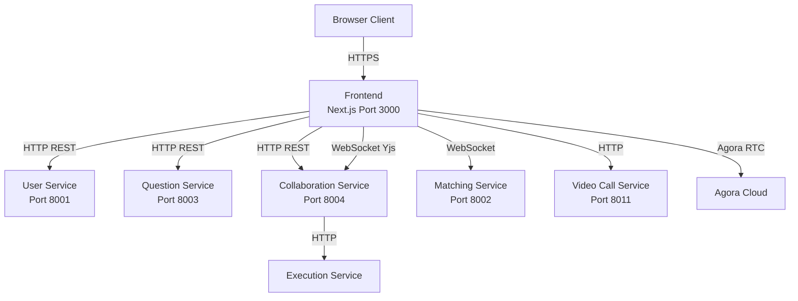

# Frontend README

## Overview

Peerprep frontend is a Next.js-based web application that provides the user interface for the peer programming platform. It enables users to match with partners, collaborate on coding problems in real-time, execute code, and communicate via video calls. The application uses React with TypeScript, real-time WebSocket connections, and integrates with multiple backend microservices.

## Architecture & Deployment

### Microservices Layout

The frontend integrates with the following backend services:

- **User Service** - Port 8001 (authentication, account management)
- **Matching Service** - Port 8002 (WebSocket for user matching)
- **Question Service** - Port 8003 (question management)
- **Collaboration Service** - Port 8004/8005 (HTTP API and WebSocket for collaborative coding)
- **Video Call Service** - Port 8011 (Agora token generation)
- **Execution Service** - Code execution (via collaboration service)

### Data Flow

**Authentication Flow:**

1. User logs in via User Service
2. Receives JWT access token and refresh token (HTTP-only cookie)
3. Access token stored in localStorage for API requests
4. Automatic token refresh on 401 responses

**Matching Flow:**

1. User connects to Matching Service via Socket.IO
2. User selects topic and difficulty preferences
3. Frontend emits matchStart event via WebSocket
4. Receives matchCountdown, roomPreparing, and matchSuccess events
5. Redirects to practice room on successful match

**Collaboration Flow:**

1. User enters practice room with roomId
2. Frontend fetches room details and question via HTTP APIs
3. Connects to Collaboration Service WebSocket for real-time code sync (Yjs)
4. Connects to Video Call Service for Agora token
5. Code changes synchronized via Yjs WebSocket provider
6. Code execution submitted via HTTP API, results received via WebSocket callback

### Key Integrations

- **Next.js**: React framework with server-side rendering and routing
- **Socket.IO Client**: Real-time bidirectional communication with matching and collaboration services
- **Yjs + Y-WebSocket**: Collaborative text editing for shared code editor
- **Monaco Editor**: Code editor with syntax highlighting
- **Agora RTC**: Video call functionality
- **Zustand**: Client-side state management
- **React Query**: Server state management and caching
- **Axios**: HTTP client for REST API calls

### Architecture Diagram



## API Documentation

### Authentication API

**login(credentials: LoginRequest): Promise<LoginResponse>**

- **Description**: Authenticate user and receive access token
- **Endpoint**: POST /v1/login
- **Request**: `{ username: string, password: string }`
- **Response**: `{ message: string, userId: string, accessToken: string }`

**register(userData: RegisterRequest): Promise<RegisterResponse>**

- **Description**: Register new user account
- **Endpoint**: POST /v1/register
- **Request**: `{ username: string, email: string, password: string }`
- **Response**: `{ message: string, verificationToken?: string }`

**verify(payload: VerifyRequest): Promise<VerifyResponse>**

- **Description**: Verify email with verification code
- **Endpoint**: POST /v1/verify
- **Request**: `{ verificationCode: number, verificationToken: string }`
- **Response**: `{ message?: string, accessToken?: string }`

**logout(): Promise<void>**

- **Description**: Logout current user
- **Endpoint**: POST /v1/logout
- **Authentication**: Required

**forgotPassword(payload: ForgotPasswordRequest): Promise<ForgotPasswordResponse>**

- **Description**: Request password reset
- **Endpoint**: POST /v1/forgot-password
- **Request**: `{ email: string }`
- **Response**: `{ message?: string, resetToken: string }`

**resetPassword(payload: ResetPasswordRequest): Promise<{ success: boolean, message: string }>**

- **Description**: Reset password with token
- **Endpoint**: POST /v1/reset-password
- **Request**: `{ resetPasswordToken: string, newPassword: string }`

### Account API

**getAccount(): Promise<User>**

- **Description**: Get current user account details
- **Endpoint**: GET /v1/account
- **Authentication**: Required
- **Response**: `{ _id: string, username: string, email: string, role: "user" | "admin" }`

**updateAccount(payload: UpdateAccountRequest): Promise<UpdateAccountResponse>**

- **Description**: Update user account (username/password)
- **Endpoint**: POST /v1/update-account
- **Authentication**: Required
- **Request**: `{ username: string, currentPassword: string, newPassword: string }`

### Question API

**getQuestionById(questionID: string | number): Promise<Question>**

- **Description**: Get question by ID
- **Endpoint**: GET /v1/questions/:id?includeArchived=true

**getQuestionList(): Promise<Question[]>**

- **Description**: Get all active questions
- **Endpoint**: GET /v1/questions/active

**getArchivedQuestionList(): Promise<Question[]>**

- **Description**: Get all archived questions
- **Endpoint**: GET /v1/questions/archived

**createQuestion(payload: Question): Promise<Question>**

- **Description**: Create new question (admin)
- **Endpoint**: POST /v1/questions
- **Authentication**: Required

**updateQuestion(questionID: string | number, payload: Partial<Question>): Promise<Question>**

- **Description**: Update question (admin)
- **Endpoint**: PATCH /v1/questions/:id
- **Authentication**: Required

**archiveQuestion(questionID: string | number): Promise<ArchiveQuestionResponse>**

- **Description**: Archive question (admin)
- **Endpoint**: DELETE /v1/questions/:id
- **Authentication**: Required

**restoreQuestion(questionID: string | number): Promise<ArchiveQuestionResponse>**

- **Description**: Restore archived question (admin)
- **Endpoint**: POST /v1/questions/:id/restore
- **Authentication**: Required

**getTopicList(): Promise<string[]>**

- **Description**: Get list of supported topics
- **Endpoint**: GET /v1/questions/topics

**getSolutionsForQuestion(questionID: string | number, language?: string): Promise<Solution[]>**

- **Description**: Get solutions for a question
- **Endpoint**: GET /v1/questions/:id/solutions?language=...

### Collaboration API

**getRoomDetails(roomId: string): Promise<RoomDetailsResponse>**

- **Description**: Get room details including document content
- **Endpoint**: GET /api/v1/rooms/:roomId
- **Authentication**: Required
- **Response**: `{ success: boolean, room: RoomDetails, document: { content: string } }`

**getUserRooms(userId: string): Promise<GetUserRoomsResponse>**

- **Description**: Get all rooms for a user
- **Endpoint**: GET /api/v1/rooms?userId=...
- **Authentication**: Required

**changeLanguage(roomId: string, language: string): Promise<ChangeLanguageResponse>**

- **Description**: Change programming language for room
- **Endpoint**: PATCH /api/v1/rooms/:roomId/language
- **Authentication**: Required
- **Request**: `{ language: string }`

### WebSocket Events

**Matching Service Socket.IO Events:**

- **Client → Server:**
  - `matchStart`: Start matching with `{ topic: string, difficulty: string }`
  - `stopQueuing`: Cancel matching request

- **Server → Client:**
  - `matchCountdown`: Countdown timer (number)
  - `roomPreparing`: Room is being prepared
  - `matchSuccess`: Match found with `{ roomId, questionId, ... }`
  - `matchTimeout`: No match found
  - `matchCancelled`: Match cancelled due to error

**Collaboration Service WebSocket Events (Yjs):**

- Uses Yjs WebSocket provider for collaborative editing
- Automatic synchronization of code changes
- Language change notifications

## Runbooks

### Starting the Application

**Development:**

```bash
cd frontend
pnpm install
pnpm run dev
```

Application will be available at http://localhost:3000

**Production (Docker):**

```bash
docker-compose up frontend
```

**Production Build:**

```bash
pnpm run build
pnpm start
```

### Environment Variables

Required environment variables:

- `NEXT_PUBLIC_USER_SERVICE_URL`: User service base URL (default: http://localhost:8001)
- `NEXT_PUBLIC_MATCHING_SERVICE_URL`: Matching service base URL (default: http://localhost:8002)
- `NEXT_PUBLIC_QUESTION_SERVICE_URL`: Question service base URL (default: http://localhost:8003)
- `NEXT_PUBLIC_COLLABORATION_SERVICE_HTTP_URL`: Collaboration service HTTP URL (default: http://localhost:8004)
- `NEXT_PUBLIC_COLLABORATION_SERVICE_WS_URL`: Collaboration service WebSocket URL (default: ws://localhost:8005)
- `NEXT_PUBLIC_ENV`: Environment (production/development)
- `NEXT_PUBLIC_MATCHING_ENDPOINT`: Matching service endpoint for production

### Monitoring & Debugging

**Check Build Status:**

```bash
pnpm run build
```

**Type Checking:**

```bash
pnpm run typecheck
```

**Linting:**

```bash
pnpm run lint
pnpm run lint:fix
```

**View Browser Console:**

- Open browser DevTools (F12)
- Check Console tab for errors and logs
- Check Network tab for API requests
- Check Application tab for localStorage/cookies

**Debug WebSocket Connections:**

- Open browser DevTools → Network → WS tab
- Monitor Socket.IO connections
- Check connection status in React DevTools

**Common Issues:**

**Issue: Authentication failures**

- Check access token in localStorage
- Verify refresh token cookie is set
- Check User Service is running
- Verify JWT_SECRET matches backend

**Issue: WebSocket connection failures**

- Verify Matching/Collaboration services are running
- Check CORS configuration on backend
- Verify WebSocket URLs in environment variables
- Check browser console for connection errors

**Issue: Code execution timeouts**

- Check Execution Service is running
- Verify RabbitMQ connection
- Check execution timeout settings
- Review collaboration service logs

**Issue: Video call not working**

- Verify Video Call Service is running
- Check Agora credentials
- Verify Agora token generation
- Check browser permissions for camera/microphone

## Design Documentation

### Project Structure

```
frontend/
├── src/
│   ├── app/                    # Next.js app router pages
│   │   ├── auth/              # Authentication pages
│   │   ├── dashboard/         # User dashboard
│   │   ├── matching/          # Matching page
│   │   ├── practice/          # Practice room pages
│   │   └── question/          # Question management pages
│   ├── components/            # React components
│   │   ├── auth/             # Authentication components
│   │   ├── matching/         # Matching UI components
│   │   ├── practice/         # Practice room components
│   │   ├── question/         # Question management components
│   │   └── ui/               # Reusable UI components
│   ├── contexts/             # React contexts
│   │   └── auth-context.tsx  # Authentication context
│   ├── hooks/                # Custom React hooks
│   ├── lib/                  # Utility libraries
│   │   ├── api-client.ts     # API client functions
│   │   └── api-config.ts     # API configuration
│   ├── stores/               # Zustand state stores
│   │   ├── matching-store.ts # Matching state
│   │   └── collaboration-store.ts # Collaboration state
│   ├── types/                # TypeScript type definitions
│   └── utils/                # Utility functions
│       ├── config.ts         # Configuration utilities
│       ├── enums.ts          # Enum definitions
│       └── socket-manager.ts # Socket.IO manager
├── public/                   # Static assets
└── package.json
```

### State Management

**Zustand Stores:**

- **matching-store**: Manages matching state, socket connection, match status
- **collaboration-store**: Manages room state, code execution, question details

**React Query:**

- Used for server state caching and synchronization
- Automatic refetching and cache invalidation
- Optimistic updates

**React Context:**

- **auth-context**: Global authentication state and user information

### Authentication Flow

1. User submits login credentials
2. Frontend calls User Service login API
3. Receives access token (stored in localStorage) and refresh token (HTTP-only cookie)
4. Access token included in Authorization header for authenticated requests
5. On 401 response, automatically refreshes token using refresh token
6. On refresh failure, redirects to login page

### Real-time Communication

**Socket.IO (Matching Service):**

- Connection managed by SocketManager singleton
- Automatic reconnection with exponential backoff
- Token-based authentication via socket auth
- Event-driven state updates in matching-store

**Yjs WebSocket (Collaboration Service):**

- Collaborative text editing using Yjs CRDT
- Y-WebSocket provider for synchronization
- Automatic conflict resolution
- Real-time code synchronization across users

### Code Editor

**Monaco Editor Integration:**

- Syntax highlighting for multiple languages
- Code completion and IntelliSense
- Yjs integration for collaborative editing
- Language switching support
- Read-only mode for viewing

### Video Call Integration

**Agora RTC:**

- Token-based authentication
- Multi-user video/audio communication
- Screen sharing support
- Automatic reconnection handling

### Error Handling

- **API Errors**: Centralized error handling in api-client with automatic token refresh
- **Socket Errors**: Reconnection logic with user notifications
- **Execution Errors**: Timeout handling and error display
- **User Feedback**: Toast notifications for all error states

### Performance Optimizations

- **Code Splitting**: Next.js automatic code splitting
- **Image Optimization**: Next.js Image component
- **Caching**: React Query for API response caching
- **Lazy Loading**: Dynamic imports for heavy components
- **Memoization**: React.memo and useMemo for expensive computations

### Security Considerations

- **Token Storage**: Access token in localStorage, refresh token in HTTP-only cookie
- **HTTPS**: Required in production
- **CORS**: Configured on backend services
- **XSS Protection**: React's built-in XSS protection
- **CSRF Protection**: Token-based authentication
- **Input Validation**: Client-side validation with server-side verification

## Development

### Building

```bash
# Development build
pnpm run dev

# Production build
pnpm run build

# Start production server
pnpm start
```

### Code Quality

**Linting:**

```bash
pnpm run lint
pnpm run lint:fix
```

**Type Checking:**

```bash
pnpm run typecheck
```

**Formatting:**

```bash
pnpm run format
pnpm run format:check
```
